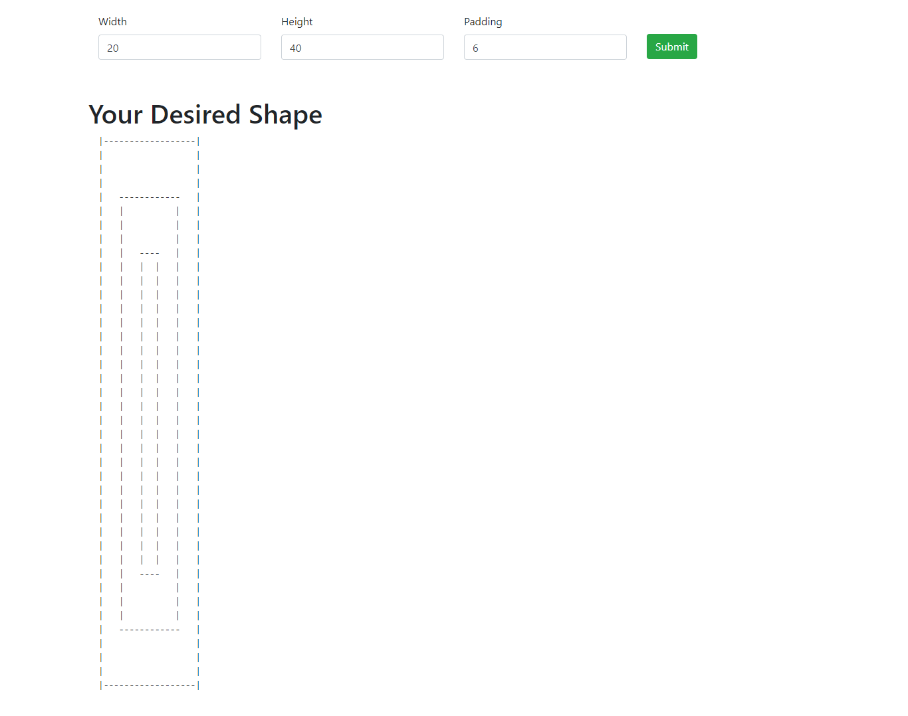
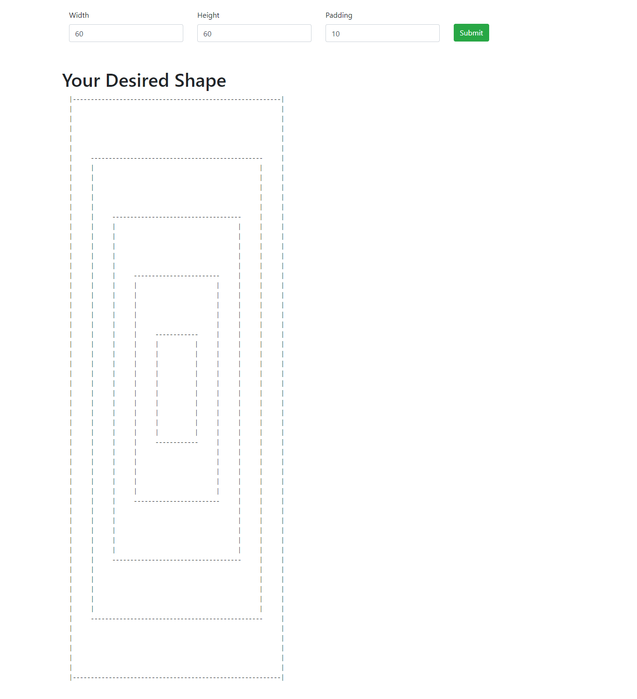
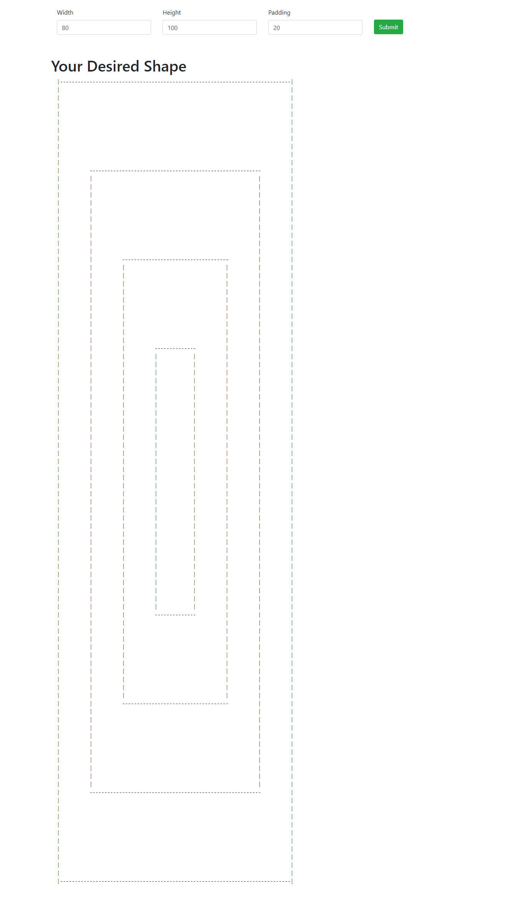

# Infinite recursive shape

## Overview

It is the recursive square drawing application, which consists of 3 input paramters __Width__, __Height__ and __Padding__ wth some validations.
I used [Vue JS](https://vuejs.org/) to make front-end which is a modern and demanding JavaScript front-end framework.

Live Demo of [App](https://recursive-square-afzal.herokuapp.com/)

CI/CD is impemented, if you pushed any commit on branch __master__ it will auto deploy for you after performing integrations.

## Validations on Input

Validations on input fields are as follows: 

- Width value should be even and greater or equal to 20 and less than or equal 300
- Height value should also be even and greater or equal to 20 and less than or equal 300
Padding value should be even and greater or equal to 4 and less than or equal 60

 
It's sound good and interesting  :ok_hand: , so let's start how it runs :runner:

## Prerequisite

For this application to work, [Node](https://nodejs.org/en/) needs to be installed on your local(host) machine.

## How to Start it :question:

Steps to start app are as follows:

- Clone the repo.
- Go to root of the repo.
- Run `npm i` it will install all dependencies. 
- Run `npm start`.
- It will start your application and you will see this on the command line 
``Server is up on port 3003`` 
- Go to the browser and hit ``localhost:30030``, it will open your application

## How to test the application works fine :question:

:white_check_mark: Input your desired height, width and padding then press __submit__ button to see the ouptut squares.

## Some screenshots fot test cases

- (Width: 20, Height:40, padding: 6)

  

- (Width: 60, Height:60, padding: 10)

  

- (Width: 80, Height:100, padding: 20)

  

  ## Big O 
  
  The Big O of this application __O(<n)__